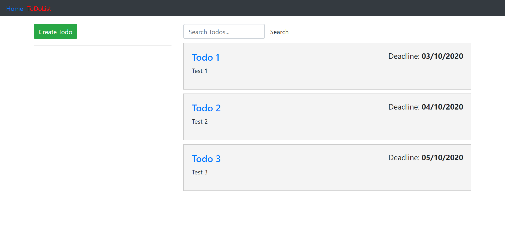

# to-do-list

This mini-project focuses on the development of a to-do list that's built using Ember.js.

## Tech Stack

* Ember (including HTML/CSS & JavaScript) 

## Prerequisites

You will need the following things properly installed on your computer.

* [Git](https://git-scm.com/)
* [Node.js](https://nodejs.org/) (with npm)
* [Ember CLI](https://ember-cli.com/)
* [Google Chrome](https://google.com/chrome/)

## Installation

* `git clone <repository-url>` this repository
* `cd to-do-list`
* `npm install`

## Running / Development

* `npm start`
* Visit your app at [http://localhost:4200](http://localhost:4200).
* Visit your tests at [http://localhost:4200/tests](http://localhost:4200/tests).

## Blockers/Resolutions

| Blockers | Resolutions |
|----------|-------------|
|          |             |